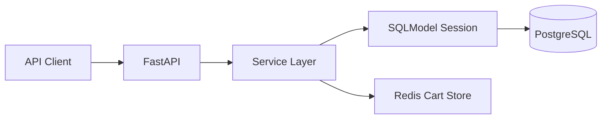

# Architecture

## Current boundaries

- `commerce.core`: configuration, database engine, Redis client, health dependencies.
- `commerce.domain`: SQLModel tables and external API schemas.
- `commerce.repositories`: query helpers that isolate persistence details.
- `commerce.services`: business transactions such as cart mutation and checkout.
- `commerce.api.routes`: HTTP resources and status-code mapping.

## Runtime topology



## Windows 11 Home strategy

Docker is optional. Prefer one of these paths:

- Native PostgreSQL installer plus Memurai Developer for Redis.
- Managed PostgreSQL and managed Redis with local `.env` connection strings.
- WSL service installs only if your Windows setup supports it comfortably.

## Migration policy

Use Alembic for schema evolution:

```powershell
alembic upgrade head
alembic revision --autogenerate -m "describe change"
```

`scripts/init_db.py` is kept for quick local experiments, not production migration.
